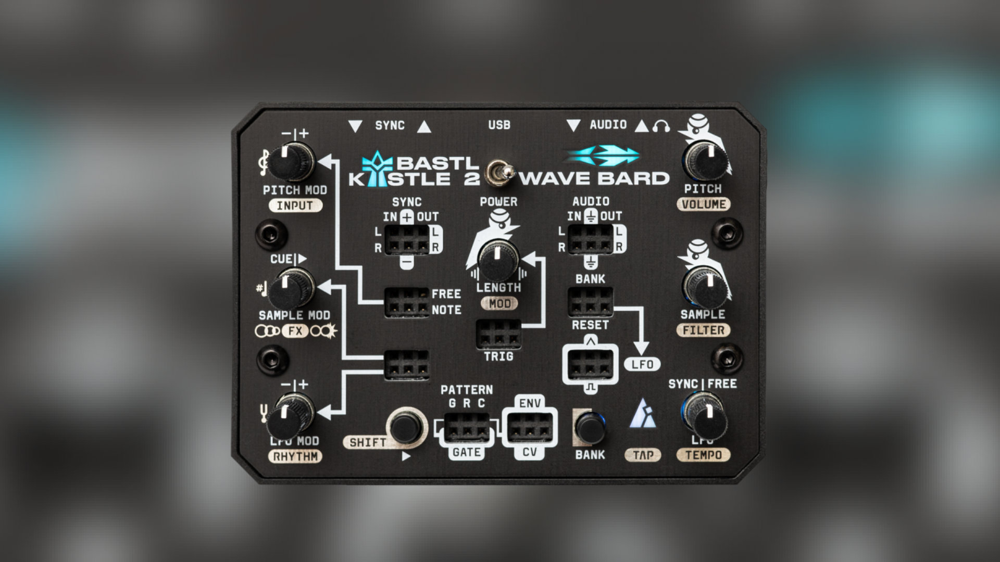
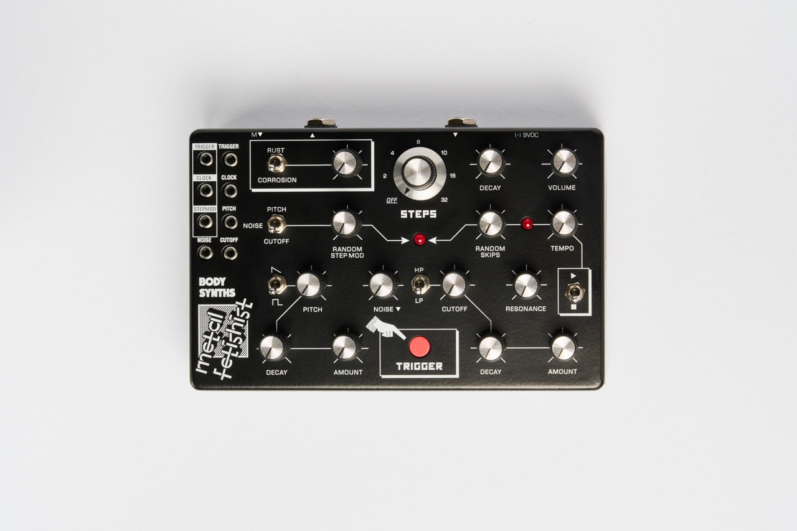

# Bastl Instruments 采访
### A Conversation with Bastl Instruments at Modular Commune, Beijing

## 简介

**Bastl Instruments** 的两位联合创始人 Václav Peloušek（开发者）与 Václav Mach（设计师）在 2025 年首次来到北京，参加本地模块合成器社区活动 **Modular Commune（交流方式）**。在为期一周的交流中，他们不仅在展台与中国音乐人面对面互动，也带来了演出与 Workshop。本次采访记录了他们对北京与 Modular Commune 的第一印象、对中国独立开发者的观察、Bastl 产品背后的设计理念，以及他们对 Eurorack 新手的建议。

Bastl Instruments' two co-founders — Václav Peloušek (developer) and Václav Mach (designer) — visited Beijing for the first time in 2025 to attend Modular Commune, the local modular synth community event. This interview captures their first impressions of Beijing, observations on Chinese independent developers, the design philosophy behind Bastl products, and their advice for Eurorack beginners.

---

## 精选

- **"Fun, Compact, Inspiring"** — Bastl Instruments 的三个品牌关键词。
- **音乐控制，而非技术控制** — "我们从音乐性而不是技术参数来设计每一个旋钮。"
- **Neo Trinity → Peloušek 的必备工具** — 他称其为"控制中心"，并分享了把它当作"调制 looper"的进阶玩法。
- **Dark Matter → Mach 的最爱** — 喜欢它"吞噬并压碎声音"的方式，极适合实验与噪音风格。
- **Kastle 系列的诞生** — 最初的想法是：做一台人人负担得起、口袋大小、可电池供电的小型模块化仪器。
- **全新固件 The Alchemist** — 集成五种合成方式，并能在模式间进行调制，实现"把一个大系统塞进一个小设备里"的野心。
- **给 Eurorack 新手的建议：从半模块开始** — 开箱即用且可扩展，是入门最好的方式。
- **如果只能买一个 Bastl 产品：Citadel Wave Bard** — "它有你开始所需的一切，并且第一分钟就很好玩。"

---

## 嘉宾介绍

**Václav Peloušek**
\#founder #developer #engineer #musician

**Václav Mach**
\#founder #designer #photographer

两人共同创立了捷克独立合成器品牌 **Bastl Instruments**，以"好玩、紧凑、启发灵感"为设计理念，产品涵盖 Eurorack 模块、独立合成器与固件平台。

---

## 采访全文

### 在 Modular Commune 的体验

#### 初到北京的印象

Q (EN): It's your first time in Beijing, in China. What are your impressions so far?

Q (CN): 这是你们第一次来中国，在北京有什么印象吗？

A (EN): The event had a lot of space for young people to perform. I think that's very important for building up the community.

A (CN): 这个活动给了年轻人很多表演空间，我觉得这对建立社区非常重要。

#### 对 Modular Commune 的整体感受

Q (EN): You were mostly engaged in the modular community event last weekend — two days at the booth, plus a performance at the main event and the after-party. What are your impressions of Modular Commune?

Q (CN): 上周末你们一直在 Modular Commune，不仅在展台两天，还有主舞台和 after party 的演出。对这个社区有什么印象？

A (EN): I felt really at home. Some of the people who make modules have been my friends for a long time, and I met them all here. I also met a lot of Chinese people, and it's been very welcoming.

A (CN): 我感觉特别像在家一样。很多做模块的朋友我认识很久了，这次都在这里遇到。也认识了很多中国的音乐人，大家都非常热情。

#### 活动中最喜欢的部分

Q (EN): Which part of the event was your favorite?

Q (CN): 活动里你们最喜欢的部分是什么？

A (EN): The performances — especially the short slots where people could try out new things.

A (CN): 表演部分，特别是那些短时间段，让大家可以自由尝试新想法的演出。

---

### 对中国独立开发者的看法

Q (EN): There are many independent developers here — like MengQi, Coding Inspire. Did anything from them catch your interest?

Q (CN): 中国有很多独立开发者，像孟奇、**Coding Inspire** 等等。你们对他们的产品有什么兴趣吗？

A (EN): MengQi is always inspiring — very great thinking behind the modules. It was great to see more, like Coding Inspire, doing interesting stuff.

A (CN): 孟奇一直都很有启发性，他的模块背后总有很棒的思考。看到像 Coding Inspire 这样更多的新开发者做有趣的东西也很棒。

---

### 关于 Bastl Instruments

#### 用三个词形容 Bastl Instruments

Q (EN): Could you describe Bastl Instruments in one to three words?

Q (CN): 用一到三个词来形容 **Bastl Instruments**，你们会怎么说？

A (EN – Peloušek): The most important thing for us is to have fun with the instruments. So: fun. And we also do a lot of compact things — compact instruments.

A (CN – Peloušek): 对我们来说最重要的是"和乐器一起玩"。所以第一个词是 **Fun（好玩）**；其次我们做了非常多小巧的乐器，那就是 **Compact（紧凑）**。

A (EN – Mach): And I'd add "inspiring".

A (CN – Mach): 那我再加一个 **Inspiring（启发灵感）**。

#### 产品设计的原则

Q (EN): Are there any consistent goals or principles when you are designing your products?

Q (CN): 在设计产品时，你们有没有始终坚持的原则？

A (EN): We try not to design every single control from a technical perspective, but from a musical goal. You have one knob and it doesn't need to set analog capacitor values. Most of our designs are digital, and even the analog ones have macro controls, with some musical intention behind every single control. We think about pots more like musical controls, not like technical controls.

A (CN): 我们是从"音乐性"来思考控制，而不是技术参数。即便是模拟设备，很多旋钮也更像是带音乐意图的宏控制。我们把旋钮看作**音乐控制器**，而不是**技术控制器**。

#### 开发过程中的有趣故事

Q (EN): Could you share an interesting story from developing one of your products?

Q (CN): 能不能分享一个你们在开发产品时的有趣故事？

A (EN – Peloušek): I've been telling this joke — I don't know if it's true or not — that the Citadel was designed by a YouTube commenter.

A (EN – Mach): That's not true.

A (EN – Peloušek): That's not true — you designed it before. But we do follow our users and their suggestions. We're always happy to develop people's ideas — but Citadel was actually our own idea.

A (CN): 我开玩笑说 **Citadel** 是一个 YouTube 网友设计的——当然不是（笑）。不过我们确实会关注用户的意见，也会采纳他们的建议。但 Citadel 这个想法本身是我们自己的。

---

### 最喜欢的 Bastl 产品

Q (EN): Name one Bastl product that's your favorite.

Q (CN): 说一个你最喜欢的 Bastl 产品。

A (EN – Peloušek): In Eurorack, I couldn't live without **Neo Trinity**. It's my control center — a CV recorder, a gesture recorder.

A (CN – Peloušek): 在 Eurorack 里，我离不开 **Neo Trinity**。它是我的控制中心，也是 CV 录制器、手势录制器。

*▲ Bastl Instruments — Neo Trinity*

A (EN – Mach): Even though I wasn't working on it, I really like **Dark Matter** — for the way it crunches the sound. You can do a lot of experimental, noisy stuff with it.

A (CN – Mach): 虽然我没直接参与它的开发，但我很喜欢 **Dark Matter**。它揉碎声音的方式很独特，非常适合做实验性的、噪音风格的东西。

*▲ Bastl Instruments — Dark Matter*

---

### 使用 Neo Trinity 的技巧

Q (EN): We are using Neo Trinity right now — any advanced tips?

Q (CN): 我们现在正用着 **Neo Trinity**，有什么进阶技巧吗？

A (EN): With Neo Trinity we rethought what modulation is, and how to do complex modulation musically. There are three different ways of creating modulation, and all of them support gestural control — you can record a knob movement and it keeps looping. It's like a looper for modulation. I think this is a very direct musical way of translating an idea into sound.

A (CN): 我们重新思考了"调制"是什么，以及如何从音乐的角度做复杂调制。Neo Trinity 提供了三种不同的调制生成方式，而且三种都支持手势控制——你可以把旋钮的动作录下来，然后让它不断循环。相当于给调制做了个 looper，非常直接的音乐表达方式。

---

### Kastle 系列的由来

Q (EN): The Kastle series has been really popular on YouTube and in China. You just released Kastle 2 last month. How did you come up with the idea?

Q (CN): **Kastle** 系列在 YouTube 和中国都特别火，上个月你们还发布了 **Kastle 2**。当初是怎么想到做这个系列的？

A (EN): It started about 10 years ago with the first Kastle — the idea was a modular synth powered by batteries, as compact as possible. Also cheap and affordable, because modular can be expensive. The first Kastle series had three modules — synth, drum machine, and an arpeggio note-playing machine. Kastle 2 is that series reworked, with more sound fidelity and more sonic possibilities. It's our favorite product because it's approachable by beginners, but people also use it in live concerts. Small but versatile — it works for big shows too.

A (CN): 最早得回到 10 年前，我设计第一代 **Kastle** 的时候——想做一台电池供电、尽可能紧凑的模块化合成器，而且要便宜，让所有人都买得起。第一代有三款：合成器、鼓机和 arpeggio 音符机。**Kastle 2** 是在第一代基础上重新打磨，音质更好，声音可能性也更丰富。它是我们最喜欢的产品之一——新手上手没有门槛，同时很多人也把它直接放到现场演出里用。体积虽小，但非常多面手。

*▲ Bastl Instruments — Kastle 2*

---

### 新固件剧透：The Alchemist

Q (EN): Since the Kastle and Citadel are platform devices with switchable firmware via USB, what's the next firmware? Can we have a spoiler?

Q (CN): **Kastle** 和 **Citadel** 都能用 USB 线切换固件，下一个固件会是什么？能给我们剧透一点吗？

A (EN): Yeah, I have a prototype here. The new firmware is called **The Alchemist**. It's a synthesizer firmware with five different synthesis modes — flexible and also very musical. They complement each other well, and what I like is that you can modulate between the modes. You can control subtractive synthesis with FM synthesis and it becomes very natural — otherwise you'd need a lot of modular gear to do these kinds of sounds and transitions. It takes over a decade of our experience in modular synths and boils it down into something instantly fun. But there's more than a decade of work behind it.

A (CN): 新固件叫 **The Alchemist**，还是原型阶段。它是一个合成器固件，内置五种合成模式，既灵活又音乐化。五种模式互相补充得很好；你还可以在不同模式之间做调制——比如拿 FM 合成去调制减法合成，过渡非常自然。如果用纯模块化去实现这种声音，需要一大套设备。而在这儿，它把我们十多年做模块合成器的经验浓缩进一台小机器里，一上手就很好玩，但背后是十多年的积累。

---

### 关于 Eurorack 初学者

#### 给新手的建议

Q (EN): Eurorack is expensive and hard to start from scratch. Any beginner tips?

Q (CN): Eurorack 很贵也很难入门，有什么建议给新手吗？

A (EN): Start with a semi-modular. They typically have everything you need to start, and expanding from a semi-modular is a great way to go. It's easier to have something pre-built, and then learn to patch it into other things.

A (CN): 从半模块开始。开箱即用，也能接入模块系统，对初学者非常友好。先有一台"预接好"的东西，再慢慢学怎么把它接去别的地方，比从零开始接线要容易。

#### 如果只能买一个 Bastl 产品

Q (EN): If you had to start from scratch and could only buy one Bastl product, which would it be?

Q (CN): 如果从零开始，只能买一个 Bastl 的产品，你们会选什么？

A (EN): That's easy — **Citadel Wave Bard**. There's a sound source, so you can put your own sound in and work with the aesthetic you choose from day one. It has MIDI input and headphone output — everything you need to connect with other gear. If you expand with one, two, three modules, it already has a powerful modulation source, so you can bring the system together from the start. Starting with a VCO and a filter can be frustrating — it's just a mono sound, and you need quite some modules before it becomes fun. With Citadel it's fun from the start. It combines a lot of modules you'd otherwise need to buy separately. If you want deeper modulation, sure, go for Neo Trinity — but Citadel will definitely get you started.

A (CN): 一定是 **Citadel Wave Bard**。它有声音源、能导入自己的声音、有 MIDI 输入和耳机输出——连接其他设备所需的一切它都有。如果之后你想再扩展一两三个模块，它自带强大的调制源，整个系统从第一天就能搭起来。很多人刚入门时会有点沮丧——买了一个 VCO 配一个滤波器，得到的就是一个单声道音色，还要再买好几个模块才开始真的能"玩"起来。而 Citadel 从开机那一刻就是好玩的，便宜，能让你直接体验到模块世界里那些好玩的调制。

---

### 最喜欢的其他品牌产品

Q (EN): Final question — share one favorite product or module that's not from Bastl.

Q (CN): 最后一个问题——说一件你最喜欢的、非 Bastl 系列的产品。

A (EN – Mach): My favorite is **Metal Fetishist** from **Body Synth**. It's an experimental drum machine in a tabletop format — looks a little like a guitar pedal. Very jammable, I use it in my performances. A really fun device, and it combines well with Kastle 2.

A (CN – Mach): 我最喜欢 **Body Synth** 的 **Metal Fetishist**。它是一台实验性鼓机，桌面小机器的形态，看起来有点像吉他单块。非常容易 jam，我在演出里会带它上台。跟 Kastle 2 搭着用也很棒。

*▲ Body Synth — Metal Fetishist*

A (EN – Peloušek): My all-time favorite has to be **Elektron Digitone** — the first one. The second one is great, but the first one is already good enough. That's the one that really helped me musically, because it's more limited. It's been one of the most inspiring pieces of gear I've had.

A (CN – Peloušek): 我的全时段最爱是 **Elektron Digitone**——初代。二代当然也很棒，但我觉得初代已经足够好。它是那台真正从音乐上帮到我的机器，正因为它的限制更多。这么多年下来，它是对我最有启发的一件器材。

*▲ Elektron — Digitone (First Gen)*

---

采访：Eddie (Entropy_Synth)
编译：xinyi
原视频：Bilibili [BV1abmxBLEkk](https://www.bilibili.com/video/BV1abmxBLEkk/)
