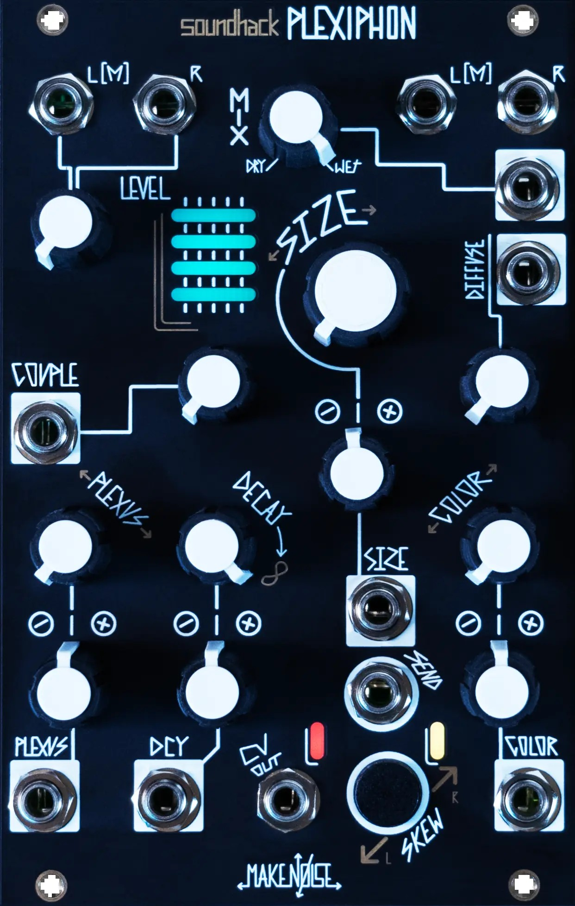

# Make Noise: SoundHack Plexiphon 采访
### Superbooth 2026 — A New Stereo Spatial Texturizer

> 来源: sonicstate — Make Noise: Soundhack Plexiphon - Superbooth 2026
> 链接: https://www.youtube.com/watch?v=gSAGc_-cWrs
> 作者: Matt (sonicstate)

## 简介

在 Superbooth 2026 上，sonicstate 的 Matt 与 **Make Noise** 的 Walker 聊了聊全新模块 **SoundHack Plexiphon**——一款与 Tom Erb 合作开发的立体声空间纹理化器。这是继 **Morphagene**、**Spectraphon**、**Mimeophon** 之后，Make Noise 与 SoundHack 合作的又一力作。

At Superbooth 2026, sonicstate's Matt sat down with Walker from Make Noise to discuss the brand new SoundHack Plexiphon — a stereo spatial texturizer module developed in collaboration with Tom Erb, following their previous collaborations on Morphagene, Spectraphon, and Mimeophon.

---

## 精选

- **"Plexus"来自拉丁语"编织"** — 核心控制 Plexus 决定反馈路径的数量与复杂度，从混响到多抽头延迟无缝过渡。
- **从混响到延迟的平滑切换** — 开发的大量时间花在确保参数之间的平滑过渡上。
- **高度互相关联的参数** — 所有控制都在同时作用于多条延迟路径，彼此深度交互。
- **无模式设计（Modeless）** — 任何时候都可以从任何位置到达任何参数极值。
- **Send Gate 输入** — 可以只让特定门信号时刻的声音进入处理，实现"点描式回声"效果。
- **不是典型的延迟或混响** — 更像是一个模糊的、两者共存的声音世界。
- **定价 $469 USD** — 2026 年 6 月初发货。

---

## 嘉宾介绍

**Walker**
\#Make_Noise #product_specialist #demo

Make Noise 产品专家，负责产品演示与展会沟通。Make Noise 是美国北卡罗来纳州的 Eurorack 模块品牌，以 Maths、Morphagene、DPO 等经典模块闻名。

---

## 采访全文

### 什么是 SoundHack Plexiphon

Q (EN): This is the new Plexiphon, right? So what is it?

Q (CN): 这是新的 Plexiphon 对吧？它是什么？

A (EN): It's the SoundHack Plexiphon. It is a new stereo spatial texturizer module that we developed in conjunction with Tom Erb. We've of course worked with him on many projects before — from the Morphagene to Spectraphon, Mimeophon and plenty of others. This module is encoded from scratch on a brand new idea by Tom on our latest digital hardware, and it is taking the idea of "Plexus" which gives it its name — that is the Latin root for "weave" — and what it's doing is weaving some sound together through a number of different feedback paths and delay taps.

A (CN): 这是 **SoundHack Plexiphon**，一个全新的立体声空间纹理化器模块，我们和 Tom Erb 合作开发。我们之前和他合作过很多项目——从 **Morphagene** 到 **Spectraphon**、**Mimeophon** 等等。这个模块是 Tom 在我们最新的数字硬件上从零开始编写的全新想法。它的名字来自"Plexus"——拉丁语"编织"的意思——它所做的就是通过多条不同的反馈路径和延迟抽头，将声音编织在一起。

*▲ Make Noise — SoundHack Plexiphon*

---

### Plexus 控制：从混响到延迟

A (EN): The Plexus control being the key control, it will determine the overall number of feedback paths and delay taps and how complex the relationship between those is. When we have Plexus turned all the way down, the module operates as if it's kind of like a reverb — many of the paths are all very tightly interwoven to create this sense of echoing space. Now as we turn the Plexus up more and more, we'll start to hear the individual taps beginning to stick out in the mix. The size is now akin to a rate control on an echo module. And we can always move very smoothly from one extreme to the other.

A (CN): **Plexus** 是核心控制，它决定了反馈路径和延迟抽头的总数量，以及它们之间关系的复杂程度。当 Plexus 调到最低时，模块的表现类似混响——所有路径紧密交织，营造出回响空间感。随着 Plexus 逐渐调高，你会开始听到单独的抽头从混音中凸显出来，Size 控制变得更像回声模块的速率控制。而且你可以始终在两个极端之间非常平滑地过渡。

---

### 开发重点：平滑过渡

A (EN): A lot of the development time on this module was just ensuring that we can do all this very smoothly. Very smooth switch from reverb to delay. Very smooth modulation of size. Smooth modulation of timbre parameters like color.

A (CN): 这个模块的大量开发时间都花在确保一切都能非常平滑地运作上。从混响到延迟的平滑切换，Size 的平滑调制，以及像 Color 这样的音色参数的平滑调制。

---

### 音色与立体声参数

A (EN): The Diffuse and Color are our timbre parameters, and then we also have the Couple and Skew, which are stereo operations. Couple is determining how the left and right channels are interacting sound-wise, and Skew giving some other options for interacting with the left and right channels control-wise.

A (CN): **Diffuse** 和 **Color** 是音色参数；另外还有 **Couple** 和 **Skew**，这是立体声操作。Couple 决定左右声道在声音层面如何互动，Skew 则提供了在控制层面与左右声道互动的其他选项。

---

### 高度互关联的参数设计

Q (EN): It sounds to me like everything's kind of working together. It's not necessarily a linear signal path throughout the module.

Q (CN): 听起来所有东西都在一起协作，不是一个线性的信号路径。

A (EN): These parameters are highly interrelated to each other because we're always working on a different number of delay paths — with Plexus changing the number of delay paths, it's also changing the relation between them. Developing this module was a lot about finding the exact relations between them so that they could all interact without anything causing the whole system to explode — which was happening a lot during development. But I feel like we've fine-tuned it very nicely and it's very playable. It's modeless. You can reach every single extreme of parameter from any place at any time.

A (CN): 这些参数之间高度互相关联，因为我们始终在处理不同数量的延迟路径——Plexus 改变路径数量的同时也在改变它们之间的关系。开发这个模块的很大一部分工作就是找到它们之间精确的关系，让所有参数能够互动而不会导致整个系统"爆炸"——开发过程中这种情况经常发生。但我觉得我们已经把它调得非常好了，非常可演奏。它是**无模式的（modeless）**——你可以在任何时候从任何位置到达任何参数极值。

---

### Send Gate：点描式回声

A (EN): We also have the Send Gate input. If we hold that low, it just doesn't send anything through to the Plexus. But if I send a gate in, then whatever's coming through at that moment that the gate is high will be sent in and then continue to echo out through the paths. So this can be really useful if you want to send just individual notes of a sequence through, so that it's not just echoing everything, but you're getting some kind of pointillist echoes that help work with the shape and contour of your sequence.

A (CN): 我们还有一个 **Send Gate** 输入。如果保持低电平，就不会有任何信号送入 Plexus。但如果我发送一个门信号，那么门信号为高的那一刻正在通过的声音就会被送入，然后继续在路径中回响。所以如果你想只让序列中的个别音符通过，这就非常有用——不是把所有东西都回声化，而是得到一种"点描式回声"，帮助配合你序列的形状和轮廓。

---

### 整体印象与发售信息

Q (EN): The final output of it isn't a typical delay or reverb sound. It feels like it's a very kind of blurred world that they're both situating themselves into. It sounds absolutely lovely. As I like to call things, they're really vibey.

Q (CN): 最终的输出不是典型的延迟或混响声音。感觉更像是一个模糊的世界，两者都栖息其中。听起来非常美。用我喜欢的说法——非常有氛围感（vibey）。

A (EN): Very much so. It can give you really nice beautiful textures to overlay or have things sit into, or you can get wild with modulation and turn it into kind of its own entire voice instrument in itself. We'll be shipping this in early June at a MSRP of $469 USD.

A (CN): 确实如此。它可以给你非常美的纹理来叠加或让声音融入其中，也可以用调制把它玩得很疯，让它变成一个完整的声音乐器。我们将在六月初发货，建议零售价 **$469 美元**。

---

采访：Matt (sonicstate)
来源：YouTube [gSAGc_-cWrs](https://www.youtube.com/watch?v=gSAGc_-cWrs)
活动：Superbooth 2026
