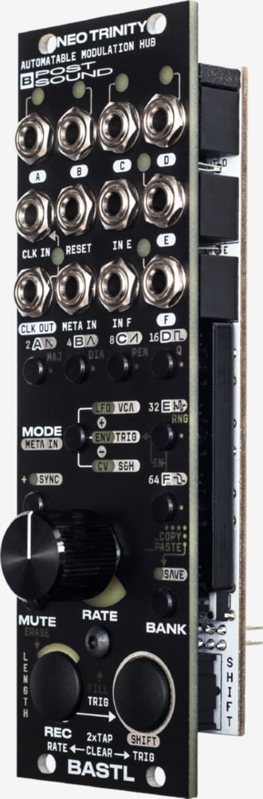
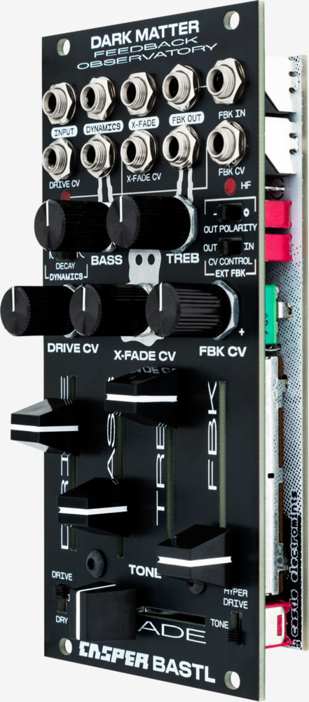
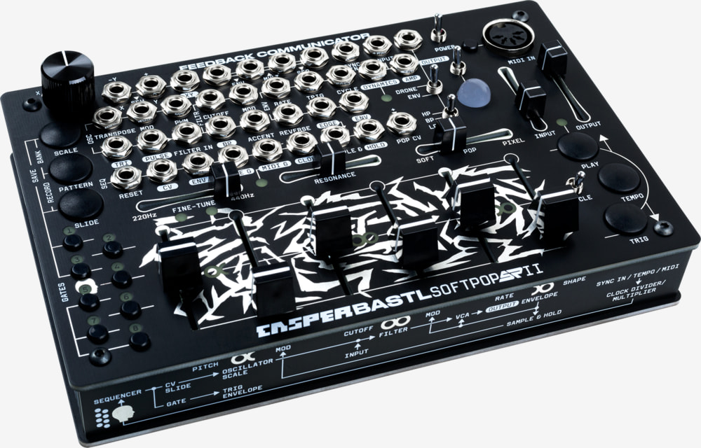
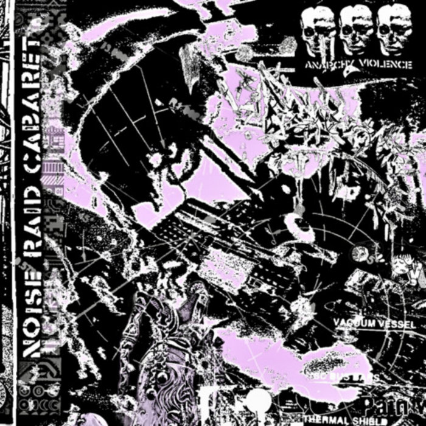
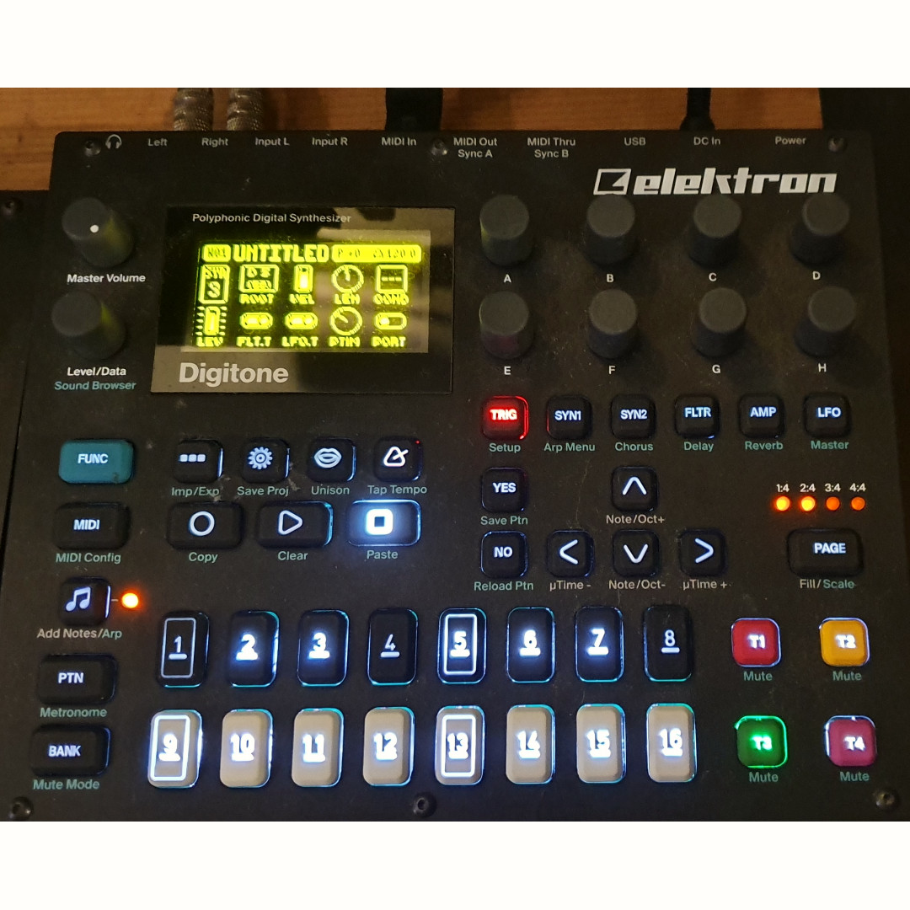

# 好玩、紧凑、启发灵感 —— Bastl Instruments 中国行专访
### Fun, Compact, Inspiring — A Conversation with Bastl Instruments in China

> **摘要 / Summary**
>
> 捷克独立合成器品牌 **Bastl Instruments** 的两位联合创始人首次来到中国，参加北京 ModulHertz 模块音乐节。Entropy_Synth 在现场与他们聊了聊品牌的三个关键词、旗舰模块 **Neo Trinity** 与 **Kastle** 系列背后的设计思路，以及即将登场的新固件 **Alchemist**。
>
> Bastl Instruments' two co-founders visit China for the first time for Beijing's ModulHertz festival. In this short interview with Entropy_Synth, they share their brand philosophy, the thinking behind flagship products like Neo Trinity and the Kastle series, and tease the upcoming Alchemist firmware.

---

## 写在前面 / Preface

**主持人**：大家好，今天我们在北京有幸邀请到了来自捷克 **Bastl Instruments** 的两位代表，进行一次针对中国模块社区的特约访谈。坐在我左边的是 Bastl Instruments 的设计师，这边的是开发者。为了采访的流畅度，整段访谈将会用英文进行，中文翻译稿随后发布在公众号上。

*Host: Today in Beijing we're joined by two representatives from Czech synth maker **Bastl Instruments** for a special conversation with the Chinese modular community. To my left is the designer; to the other side is the developer. The interview is in English, with a Chinese translation to follow on our WeChat account.*

---

## 一、中国初印象 / First Impressions of China

**主持人**：这是你们第一次来到北京、来到中国，有什么印象？

**设计师**：这次活动给了年轻音乐人大量的现场演出空间。我觉得这一点对建立一个模块社区非常重要。

*Designer: The event had a lot of space for young people to perform, and I think that's very important for building up the community.*

**主持人**：你们整个周末都扑在模块社区里，连续两天备展，还有主舞台演出和 after party。对中国的模块社区整体印象如何？

**开发者**：感觉像回家一样。几位一起做模块的同行本来就是我多年的老朋友，这次在这儿又全都碰上了。也认识了很多中国玩家，大家都特别热情。

*Developer: I felt really at home. Some of the people who make modules have been my friends for a long time, and I met them all here. I also met a lot of Chinese people, and it's been very welcoming.*

**主持人**：这次活动里你们最喜欢哪一块？

**开发者**：各种现场演出，尤其是那些让大家轮流上台试新东西的短时段。

*Developer: The performances, especially the short slots where people could try out new things.*

---

## 二、对中国独立开发者的观察 / On Chinese Independent Developers

**主持人**：中国也有不少做模块的独立开发者，比如 **红齐（Hong Chi）**、**Coding Inspire** 等等。你们觉得他们的产品和想法有什么让你们眼前一亮的吗？

**开发者**：红齐一直很有启发性，他设计模块背后的思路非常好。能在这儿看到更多中国开发者——像 Coding Inspire 这些——都在做有意思的东西，真的很棒。

*Developer: Hong Chi is always inspiring — very great thinking behind the modules. It was great to see more, like Coding Inspire, doing interesting stuff.*

---

## 三、用三个词形容 Bastl Instruments / Bastl in Three Words

**主持人**：作为品牌整体的视角，能用一到三个词形容 **Bastl Instruments** 吗？

**开发者**：对我们来说最重要的是"和乐器一起玩"。所以第一个词是 **Fun（好玩）**；其次我们做了非常多小巧的乐器，那就是 **Compact（紧凑）**。

*Developer: The most important thing for us is to have fun with the instruments. So: fun, and we also do a lot of compact things — compact instruments.*

**设计师**：那我再加一个 **Inspiring（启发灵感）**。

*Designer: And I'd add inspiring.*

**主持人**：Fun、Compact、Inspiring —— 好玩、紧凑、启发灵感。

---

## 四、设计哲学：把旋钮当成音乐控制 / Design Philosophy: Musical Controls, Not Technical Controls

**主持人**：在设计产品时，有没有什么始终贯穿的原则？

**开发者**：就是这三个词本身——启发灵感，以及保持音乐性。所以我们尽量不从"技术参数"的角度去设计每一个旋钮，而是从"音乐目的"的角度出发。你手里只有一个旋钮，它不需要去对应电容值或什么技术参数。我们绝大多数设计是数字的；即使是模拟电路的产品，也会用一些宏观控制（macro controls），让每一个旋钮背后都有一个音乐意图。对我们来说，旋钮更像是 **音乐控制器**，而不是 **技术控制器**。

*Developer: We try not to design every control from a technical perspective, but from a musical goal. You have one knob, and it doesn't need to set analog capacitor values. Most of our designs are digital, and even the analog ones have macro controls, with some musical intention behind every single control. We think about pots more as musical controls, not technical controls.*

---

## 五、一个开发趣事：Kastle 不是 YouTube 网友设计的 / A Development Story

**主持人**：能分享一个开发产品过程中的有趣故事吗？

**开发者**：让我想想……最近我讲了个段子，连我自己都不确定是真是假——我跟别人开玩笑说 **Kastle** 其实是一位 YouTube 评论区的网友设计的。

**设计师**：（笑）那不是真的。

**开发者**：那不是真的，那明明是你设计在先的。

*Developer: I've been telling this joke — I don't know if it's true or not — that the Kastle was designed by a YouTube commenter. Designer: That's not true. Developer: That's not true — you designed it before.*

**主持人**：所以，如果我们有什么新产品的想法，也可以去你们 YouTube 频道评论区留言？

**开发者**：我们确实会关注用户的反馈和建议，也很乐意把大家的想法发展成产品。但 **Kastle** 这个想法本身，是我们自己想出来的。

*Developer: We do follow users and their suggestions, and we're always happy to develop people's ideas — but Kastle was actually our own idea.*

---

## 六、各自最爱的自家产品 / Favorite Bastl Products

**主持人**：说一件你最喜欢的自家产品。

**开发者**：如果限定在 Eurorack 模块里，我离不开 **Neo Trinity** —— 它是我的控制中心，也是 CV 录制器、手势录制器。

*Developer: In Eurorack, I couldn't live without Neo Trinity — it's my control center, a CV recorder, a gesture recorder.*

*▲ Bastl Instruments — Neo Trinity*

**主持人**：你呢？

**设计师**：我虽然没直接参与它的开发，但很喜欢 **Dark Matter**。它揉碎声音的方式很独特，可以做很多实验性的、噪声的东西。那是我的最爱。

*Designer: Even though I wasn't working on it, I really like Dark Matter — for the way it crunches the sound. You can do a lot of experimental, noisy stuff with it.*

*▲ Bastl Instruments — Dark Matter*

---

## 七、Neo Trinity 进阶用法 / How to Use Neo Trinity

**主持人**：我们现在正用着 **Neo Trinity**，有什么进阶玩法和技巧？

**开发者**：设计 Neo Trinity 的时候，我们重新思考了"什么是调制"，以及如何从音乐的角度去做复杂的调制。所以它提供了三种不同的调制生成方式，而且三种都支持"手势控制"——你可以把旋钮的动作录下来，然后让它不断循环。相当于给调制做了个 looper。我觉得这是一种非常直接的音乐表达方式，能把脑子里的想法直接翻译进声音里。

*Developer: With Neo Trinity we rethought what modulation is, and how to do complex modulation musically. There are three different ways of creating modulation, and all of them support gestural control — you can record a knob movement and it keeps looping. It's like a looper for modulation, a very direct musical way of translating an idea into sound.*

---

## 八、Kastle 系列的由来 / The Kastle Series Origin

**主持人**：最近 **Kastle** 这种独立形态的小机器在全球 YouTube 和中国都特别火，上个月你们还发布了 **Kastle 2**。当初是怎么想到做这样一个系列的？

**开发者**：最早得回到 10 年前，我设计第一代 **Kastle** 的时候——那时候就想做一台电池供电、尽可能紧凑的模块化合成器。而且要便宜，让所有人都买得起——因为模块化这条路本身可以非常贵。

第一代 **Kastle** 系列有三款：一台合成器、一台鼓机，还有一台 arpeggio 音符机。**Kastle 2** 其实就是把第一代重新做了一遍，音质更好，声音可能性也更丰富。它是我们自己都很喜欢的产品——新手上手没有门槛，同时很多人也把它直接放到现场演出里用。它体积虽小，但非常多面手，哪怕是大型演出也能用得上。

*Developer: It started 10 years ago with the first Kastle — the idea was a modular synth powered by batteries, as compact as possible. Also cheap and affordable, because modular can be expensive. The first Kastle series had three modules — synth, drum machine, and an arpeggio note-playing machine. Kastle 2 is that series reworked, with more sound fidelity and more sonic possibilities. It's our favorite product because it's approachable by beginners, but people also use it in live concerts. Small but versatile — it works for big shows too.*

*▲ Bastl Instruments — Kastle 2*

---

## 九、新固件剧透：Alchemist / Firmware Spoiler: The Alchemist

**主持人**：**Kastle 2** 的一个核心是平台化，用 USB 线就能刷固件。那下一个固件会是什么？能给我们剧透一点吗？

**开发者**：正好带了一台在身边。新固件叫 **Alchemist**，还是个原型阶段。

*Developer: Yeah, I have a prototype here. The new firmware is called Alchemist.*

**主持人**：那 **Alchemist** 是什么？

**开发者**：**Alchemist** 是一个合成器固件，内置五种不同的合成模式，既灵活又音乐化。这五种模式互相之间互补得很好；我最喜欢的一点是，你还可以在不同模式之间做互相调制——比如拿 FM 合成去调制减法合成，过渡非常自然。如果你用纯模块化去实现这种声音和模式切换，需要一大套设备。而在这儿，它把我们十多年做模块合成器的经验浓缩进一台小机器里，一上手就很好玩，但背后是十多年的积累。

*Developer: Alchemist is a synthesizer firmware with five different synthesis modes — flexible and also very musical. They complement each other well, and what I like is that you can modulate between the modes. You can control subtractive synthesis with FM synthesis and it becomes very natural — otherwise you'd need a lot of modular gear to do these kinds of sounds and transitions. It takes over a decade of our experience in modular synths and boils it down into something instantly fun, but there's more than a decade of work behind it.*

---

## 十、给新手的建议：从半模块开始 / Tips for Beginners: Start Semi-Modular

**主持人**：很多新手会有这样的问题：想入 Eurorack，但又贵、又不知道怎么从零搭起来。有什么建议吗？

**开发者**：我建议从 **半模块（semi-modular）** 开始。半模块通常自带了上手所需要的一切；从一台半模块出发再去扩展，是一条比较舒服的路。手里先有一台已经"预接好"的东西，然后再慢慢学怎么把它接去别的地方，总比从零开始接线要容易。

*Developer: Start with a semi-modular. They typically have everything you need to start, and expanding from a semi-modular is a great way to go. It's easier to have something pre-built, and then learn to patch it into other things.*

---

## 十一、如果只能买一件 Bastl，买什么？/ One Bastl Product to Start With

**主持人**：如果让你从零搭一套架子，只能先买一件 **Bastl Instruments** 的产品，你会选哪件？

**开发者**：这个简单—— **Softpop**。它自带声源，你可以灌进自己想要的声音，从一开始就能围绕自己喜欢的音色去工作。它可玩性也很高，带 **MIDI 输入** 和 **耳机输出**，基本上你要接别的设备所需要的一切它都有。而且它本身就很好玩。

如果之后你想再扩展一两三个模块，它也带着相当强大的调制源，整个系统从第一天就能搭起来。我可以保证：从这儿扩展出去，一定是好玩的。

很多人刚入门时会有点沮丧——比如你买了一个 VCO 再配一个滤波器，得到的就是一个单声道的音色，还要再买好几个模块才开始真的能"玩"起来。而 **Softpop** 从开机那一刻就是好玩的，便宜，能让你直接体验到模块世界里那些好玩的调制。它把本来需要分开买的很多模块都整合在一起了。如果你之后想玩更深度的调制，当然可以上 **Neo Trinity** 之类的产品，但 **Softpop** 绝对是那个能让你启程的东西。

*Developer: That's easy — Softpop. There's a sound source, so you can put your own sound in and work with the aesthetic you choose from day one. It has MIDI input and headphone output — everything you need to connect with other gear. If you expand with one, two, three modules, it already has a powerful modulation source, so you can bring the system together from the start. Starting with a VCO and a filter can be frustrating — it's just a mono sound, and you need quite some modules before it becomes fun. With Softpop it's fun from the start. It combines a lot of modules you'd otherwise need to buy separately. If you want deeper modulation, sure, go for Neo Trinity — but Softpop will definitely get you started.*

*▲ Bastl Instruments × RYK Modular — Softpop SP2*

---

## 十二、自家之外的最爱器材 / Favorite Non-Bastl Gear

**主持人**：最后一个问题——说一件你最喜欢的、非 Bastl 系列的产品或模块。

**设计师**：我最喜欢 **Noise Engineering** 的 **Metal Fetishist**。

*Designer: My favorite is Metal Fetishist from Noise Engineering.*

**主持人**：我之前试过。

**设计师**：它是一台实验性的鼓机，桌面小机器的形态，看起来有点像吉他单块。非常容易 jam，我在自己的演出里会带它上台。是那种真的很好玩的小东西，跟 **Kastle 2** 搭着用也很棒。

*Designer: It's an experimental drum machine in a tabletop format — looks a little like a guitar pedal. Very jammable, I use it in my performances. A really fun device, and it combines well with Kastle 2.*

*▲ Noise Engineering — Metal Fetishist*

**主持人**：那你呢？

**开发者**：我得说我的全时段最爱是 **Elektron Digitone**——初代。二代当然也很棒，但我觉得初代已经足够好。它是那台真正从音乐上帮到我的机器，正因为它的限制更多。这么多年下来，它是对我最有启发的一件器材。

*Developer: My all-time favorite has to be Elektron Digitone — the first one. The second one is great, but the first one is already good enough. That's the one that really helped me musically, because it's more limited. It's been one of the most inspiring pieces of gear I've had.*

*▲ Elektron — Digitone (初代 / First Gen)*

---

## 结语 / Closing

**主持人**：非常感谢两位。这就是我们这次简短访谈的最后。感谢各位观看，欢迎关注我们的公众号与频道。之后我们会持续发布更多来自 **Bastl Instruments** 的中文官方视频教程。

*Host: Thank you both. That's the end of this short interview — thanks for watching, and stay tuned on our WeChat account and channel for more official Bastl Instruments tutorials in Chinese.*

---

## 品牌与产品提及 / Brands & Products Mentioned

| 品牌 / Brand | 产品 / Product |
|---|---|
| **Bastl Instruments**（捷克） | Neo Trinity, Kastle, Kastle 2, Dark Matter, Alchemist（固件） |
| **Bastl Instruments × RYK Modular** | Softpop SP2 |
| **Noise Engineering** | Metal Fetishist |
| **Elektron** | Digitone（初代）, Digitone II |
| 中国独立开发者 | 红齐 (Hong Chi), Coding Inspire |
| 活动 | 北京 **ModulHertz** 模块音乐节 |

---

*访谈：Entropy_Synth × Bastl Instruments*
*原视频：Bilibili [BV1abmxBLEkk](https://www.bilibili.com/video/BV1abmxBLEkk/)*
